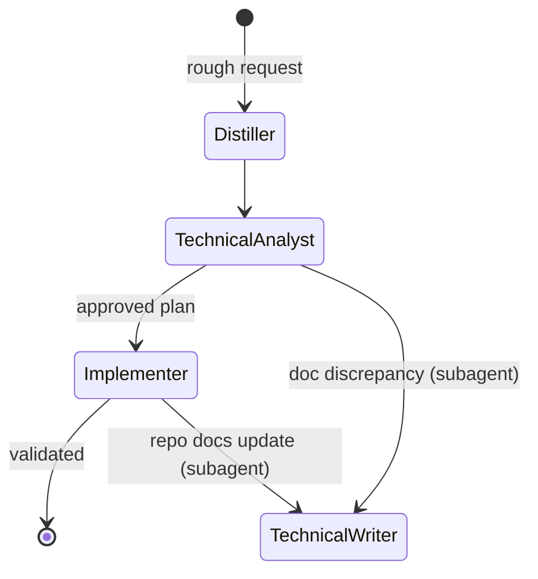

# Engineering Workflow Plugin

This plugin provides a workflow for turning a rough request into a verified implementation and, when needed, a contributor-facing documentation update. The workflow is intentionally opinionated: clarify first, analyze before coding, implement with validation, and use a Technical Writer when contributor documentation should be repaired or traced.

## Workflow

The diagram shows a **linear workflow with bounded subagent delegation**. The primary path is Distiller → Technical Analyst → Implementer → complete. The Technical Analyst and Implementer can automatically delegate self-contained documentation tasks to the Technical Writer as a subagent; the subagent returns to its parent, not as a handoff but as a result.

In the normal path, the Distiller turns a messy ask into a clean handoff, the Technical Analyst verifies the problem against the codebase and produces the smallest sound plan, and the Implementer executes that plan with minimal changes and relevant validation. When the task needs a durable contributor-facing written trace, the Implementer delegates a scoped documentation pass to the Technical Writer as a subagent. When the Technical Analyst encounters a proven code/documentation discrepancy that should be resolved before implementation, it delegates a self-contained documentation fix to the Technical Writer as a subagent. The writer discovers the right contributor-doc location from the target repository, asks the user when the destination is ambiguous, and returns results to the delegating agent. Explicit handoffs remain available only when the user should see or steer the role transition.

## Agents

- **Distiller**: Clarifies rough notes or ambiguous requests into a concise handoff prompt for the Technical Analyst. It may do limited workspace reconnaissance to resolve scope or terminology, but it does not analyze solutions or implement code.
- **Technical Analyst**: Verifies the request against the codebase, compares solution options, identifies required yak shaving, and produces the smallest sound design and implementation plan. It delegates self-contained documentation fixes to the Technical Writer as a subagent when a proven code/documentation discrepancy must be resolved before implementation proceeds.
- **Implementer**: Executes the approved analysis and implementation plan in the codebase, keeps enabling work isolated, validates the result, and reports deviations. It owns code-level clarity and documentation defaults in the changed code. When contributor documentation should be updated, it delegates a scoped documentation pass to the Technical Writer as a subagent.
- **Technical Writer**: Keeps contributor-facing documentation aligned with the codebase. It discovers the right documentation destination in the target repository, asks the user when ambiguous, and returns results to the delegating agent (Technical Analyst or Implementer). It handles self-contained documentation tasks only.

## Handoff Boundaries

- Distiller to Technical Analyst: a clarified task statement with context, constraints, and desired output shape.
- Technical Analyst to Implementer: an approved design and implementation plan that should be executable with minimal reinterpretation.
- Technical Analyst to Technical Writer (subagent): a proven documentation discrepancy or enabling documentation task that must be resolved before implementation.
- Implementer to Technical Writer (subagent): a structured implementation result containing change summary, rationale, affected files, validation, and contributor-documentation context when repository docs should be updated.
- Technical Analyst to editor: optionally opens the plan in an untitled editor for refinement instead of immediately starting implementation.

## Skills

- **Orient**: Helps the user fill a specific gap in their mental model of a system. Activates on "why doesn't X happen" or "how does Y work" questions where the user understands most of the system but one piece is missing. Always reads back an interpretation of the gap before answering so misunderstandings are caught early.
- **Realign**: Identifies and reports inconsistencies in code patterns across the codebase, helping to maintain a coherent engineering workflow.

## Change Log

### v1.4.0

- Refactored workflow to use linear flow with bounded subagent delegation instead of circular handoffs
- Removed circular handoffs between Implementer ↔ Technical Analyst and Technical Writer ↔ Implementer/Technical Analyst
- Technical Analyst and Implementer now delegate documentation tasks to Technical Writer as subagents
- Technical Writer no longer has handoffs back to other agents

### v1.3.0

- Added the Orient skill for targeted mental-model gap-filling

### v1.2.0

- Added the Technical Writer agent and documentation-aware workflow loops
- Documented contributor-facing documentation responsibilities and handoff boundaries

### v1.1.1

- (Hopefully) fix agent handoffs, tighten responsibilities and boundaries

### v1.1.0

- Added the Realign skill

### v1.0.1

- Renamed agents

### v1.0.0

- Initial version with Distiller, Technical Analyst, and Implementer agents
