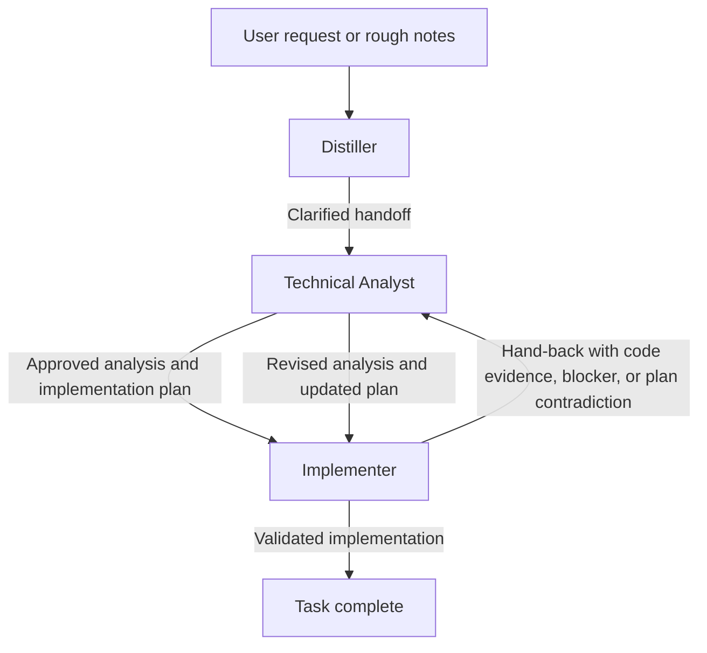

# Engineering Workflow Plugin

This plugin provides a three-stage workflow for turning a rough request into a verified implementation. The workflow is intentionally opinionated: clarify first, analyze before coding, then implement with validation. If implementation exposes a real contradiction or design gap, the work loops back to analysis with a structured hand-back rather than forcing an unsound patch.

## Workflow

In the normal path, the Distiller turns a messy ask into a clean handoff, the Technical Analyst verifies the problem against the codebase and produces the smallest sound plan, and the Implementer executes that plan with minimal changes and relevant validation.

When the code disproves the approved plan, reveals a missing prerequisite, or exposes a non-trivial design gap, the Implementer should stop and hand the task back to the Technical Analyst. That hand-back carries forward the verified evidence, partial implementation work, and the exact decision or plan revision now needed.

## Agents

- **Distiller**: Clarifies rough notes or ambiguous requests into a concise handoff prompt for the Technical Analyst. It may do limited workspace reconnaissance to resolve scope or terminology, but it does not analyze solutions or implement code.
- **Technical Analyst**: Verifies the request against the codebase, compares solution options, identifies required yak shaving, and produces the smallest sound design and implementation plan. It can also consume an Implementer hand-back and update only the parts of the plan the code has invalidated.
- **Implementer**: Executes the approved analysis and implementation plan in the codebase, keeps enabling work isolated, validates the result, and reports deviations. If the plan breaks down in a way that needs renewed analysis, it hands the task back to the Technical Analyst with a structured hand-back.

## Handoff Boundaries

- Distiller to Technical Analyst: a clarified task statement with context, constraints, and desired output shape.
- Technical Analyst to Implementer: an approved design and implementation plan that should be executable with minimal reinterpretation.
- Implementer to Technical Analyst: a hand-back containing verified code evidence, where the plan failed, any partial work already completed, and the narrow decision or revised analysis now required.
- Technical Analyst to editor: optionally opens the plan in an untitled editor for refinement instead of immediately starting implementation.

## Skills

- **Realign**: Identifies and reports inconsistencies in code patterns across the codebase, helping to maintain a coherent engineering workflow.

## Change Log

### v1.1.1

- (Hopefully) fix agent handoffs, tighten responsibilities and boundaries

### v1.1.0

- Added the Realign skill

### v1.0.1

- Renamed agents

### v1.0.0

- Initial version with Distiller, Technical Analyst, and Implementer agents
