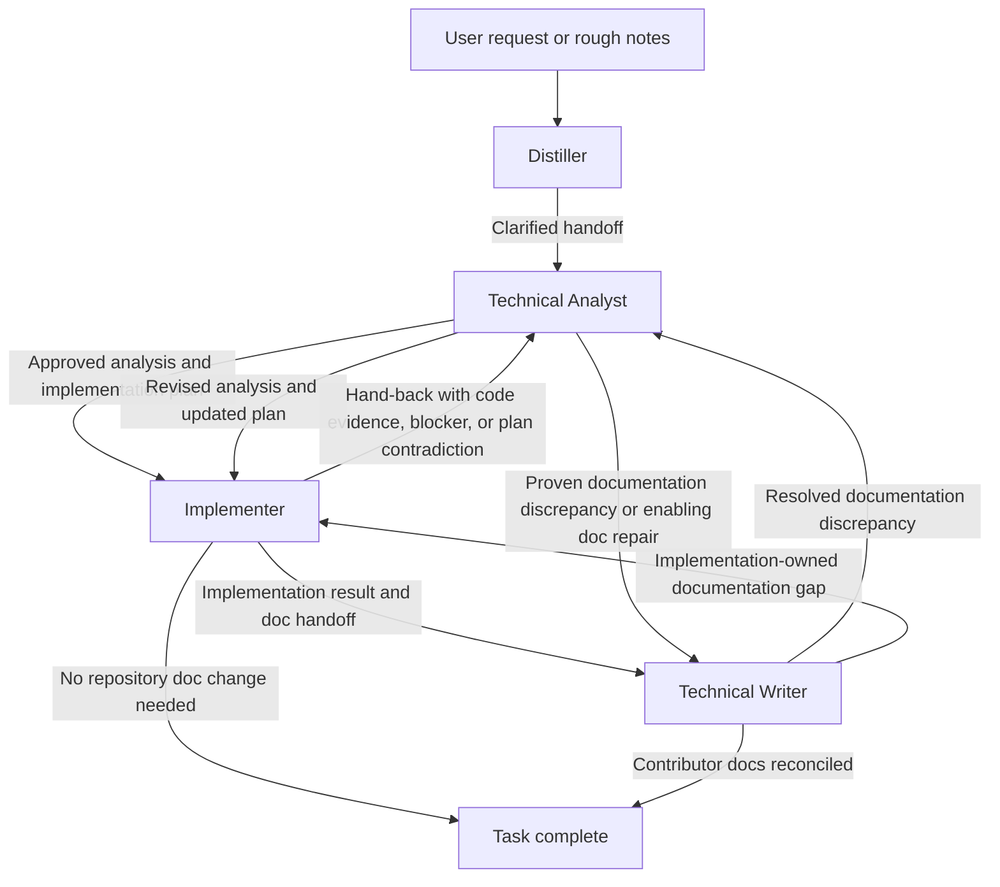

# Engineering Workflow Plugin

This plugin provides a workflow for turning a rough request into a verified implementation and, when needed, a contributor-facing documentation update. The workflow is intentionally opinionated: clarify first, analyze before coding, implement with validation, and use a Technical Writer when contributor documentation should be repaired or traced.

## Workflow

In the normal path, the Distiller turns a messy ask into a clean handoff, the Technical Analyst verifies the problem against the codebase and produces the smallest sound plan, and the Implementer executes that plan with minimal changes and relevant validation. When the task needs a durable contributor-facing written trace, the Implementer can then hand the result to the Technical Writer for a scoped documentation pass or delegate that pass automatically as a subagent when it is self-contained.

When the code disproves the approved plan, reveals a missing prerequisite, or exposes a non-trivial design gap, the Implementer should stop and hand the task back to the Technical Analyst. When the Technical Analyst finds a proven code/documentation discrepancy that should be fixed before implementation, it can invoke the Technical Writer directly or delegate to it automatically as a subagent for a self-contained documentation pass. The writer can likewise pull the Technical Analyst back in automatically for a single analysis pass when documentation work exposes a design-level contradiction, and it can pull the Implementer back in automatically for a narrow implementation-owned documentation fix. Explicit handoffs remain available when the user should see or steer the role transition. The writer discovers the right contributor-doc location from the target repository instead of assuming a fixed docs layout, asks the user when the destination is ambiguous, and may return implementation-owned source documentation gaps back to the Implementer.

## Agents

- **Distiller**: Clarifies rough notes or ambiguous requests into a concise handoff prompt for the Technical Analyst. It may do limited workspace reconnaissance to resolve scope or terminology, but it does not analyze solutions or implement code.
- **Technical Analyst**: Verifies the request against the codebase, compares solution options, identifies required yak shaving, and produces the smallest sound design and implementation plan. It can consume an Implementer hand-back, invoke the Technical Writer when scoped documentation repair is the next correct step, and update only the parts of the plan the code or documentation has invalidated.
- **Implementer**: Executes the approved analysis and implementation plan in the codebase, keeps enabling work isolated, validates the result, and reports deviations. It also owns code-level clarity and documentation defaults in the changed code, can hand the task back to the Technical Analyst when the plan breaks down, and can hand completed implementation context to the Technical Writer or delegate to it automatically when contributor documentation should be updated.
- **Technical Writer**: Keeps contributor-facing documentation aligned with the codebase. It can resolve proven documentation discrepancies for the Technical Analyst, update contributor docs after implementation, discover the right documentation destination in the target repository, and make tiny documentation-adjacent source fixes when needed without turning into a second implementation pass. It may also pull the Implementer or Technical Analyst back in automatically for one self-contained follow-up pass when that is the next correct move.

## Handoff Boundaries

- Distiller to Technical Analyst: a clarified task statement with context, constraints, and desired output shape.
- Technical Analyst to Technical Writer: a proven documentation discrepancy or enabling documentation task that should be resolved before implementation proceeds.
- Technical Analyst to Implementer: an approved design and implementation plan that should be executable with minimal reinterpretation.
- Implementer to Technical Analyst: a hand-back containing verified code evidence, where the plan failed, any partial work already completed, and the narrow decision or revised analysis now required.
- Implementer to Technical Writer: a structured implementation result containing change summary, rationale, affected files, validation, and contributor-documentation context when repository docs should be updated.
- Technical Writer to Implementer: a hand-back for implementation-owned documentation gaps, missing rationale, or similarly scoped source issues that block accurate contributor docs.
- Technical Writer to Technical Analyst: either a resolved enabling documentation pass or a documented design-level contradiction that needs renewed analysis.
- Technical Analyst to editor: optionally opens the plan in an untitled editor for refinement instead of immediately starting implementation.

## Skills

- **Realign**: Identifies and reports inconsistencies in code patterns across the codebase, helping to maintain a coherent engineering workflow.

## Change Log

### v1.2.0

- Added the Technical Writer agent and documentation-aware workflow loops
- Documented contributor-facing documentation responsibilities and handoff boundaries

### v1.1.1

- (Hopefully) fix agent handoffs, tighten responsibilities and boundaries

### v1.1.0

- Added the Realign skill

### v1.0.1

- Renamed agents

### v1.0.0

- Initial version with Distiller, Technical Analyst, and Implementer agents
