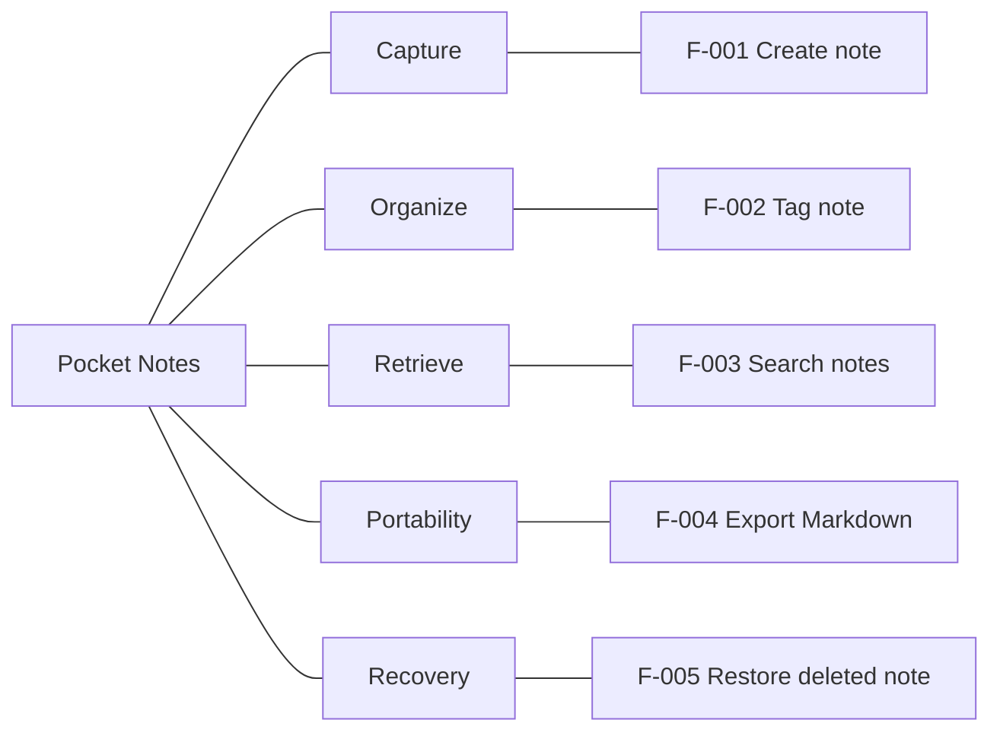

# Connected capability chart

Prefer a Mermaid `flowchart` with explicit edges to show the functional hierarchy. Connect the product root to each area and each area to its features; do not rely on indentation-based `mindmap` connections. Use stable node identifiers and keep feature IDs in quoted labels. Use `LR` for a horizontal hierarchy or `TB` when it fits the document better.

Include all inventory features by default. For a large map, split into linked area diagrams or explicitly label a selected overview. Every displayed feature must still have a path to the product root. Provide a text tree or nested list as a fallback, either immediately below the diagram or by linking to the document's feature tree.

## Example: Pocket Notes

Text fallback:

- Capture: F-001 Create note.
- Organize: F-002 Tag note.
- Retrieve: F-003 Search notes.
- Portability: F-004 Export Markdown.
- Recovery: F-005 Restore deleted note.

Keep behavioral detail and evidence in the inventory. Plain edges express containment, not execution order or dependencies. Check that node IDs are unique, feature references resolve, and every node is reachable from the product root. If the chart claims complete coverage, compare its feature IDs with the inventory. Render locally when supported to check layout and visible connections; graph connectivity checks alone do not establish rendering quality. Do not upload private product content to a diagram service for validation.
